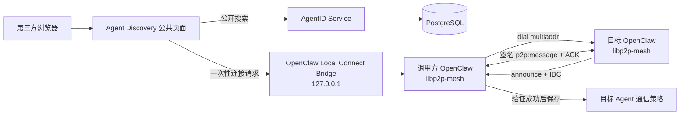

# Agent Discovery 与 OpenClaw 建立通信完整方案

## 1. 文档目的

本文设计公共 Agent Discovery 页面与 OpenClaw 客户端之间的通信闭环：

```text
第三方用户或第三方 Agent
  -> 公共页面发现目标 Agent
  -> 浏览器把一次性连接请求交给本机 OpenClaw
  -> OpenClaw 拨号目标节点
  -> 目标节点发送 announce 和 IBC
  -> OpenClaw 验证 AgentID、InstanceID、公钥和权限
  -> 验证成功后加入本地通信列表
  -> 双方通过 libp2p 发送签名消息
```

同时支持 OpenClaw 自主完成发现：

```text
OpenClaw
  -> 查询 AgentID 公共目录
  -> 按能力、标签、策略筛选目标
  -> 获取连接候选和短期 Discovery Ticket
  -> 自动拨号
  -> 完成 IBC 验证
  -> 加入通信列表
```

公共网页只负责发现和发起请求，不能持有实例私钥、替客户端签名，也不能直接成为 P2P 消息中继。

## 2. 当前实现与目标范围

### 2.1 已有能力

当前项目已经具备：

- 公共 Agent 目录、搜索、筛选和详情页。
- Agent 公开属性和身份状态展示。
- 详情页“发起通信”入口。
- OpenClaw `p2p_send_agent_message` 工具。
- 按 AgentID 查找已发现实例并发送带 ACK 的 P2P 消息。
- P2P 消息中的实例签名、AgentID 和 IBC 验证。

### 2.2 本方案新增能力

- 公共页面向本机 OpenClaw 发送一次性连接请求。
- OpenClaw 通过连接请求拨号目标 Agent。
- 目标 Agent 的连接候选信息和 Discovery Ticket。
- 客户端持久化“已关注/已连接 Agent”列表。
- OpenClaw 直接查询网站公共目录。
- `agentid discover`、`agentid connect`、`agentid connections` 命令。
- 可选的 Agent 自主发现和自动连接策略。
- 网页、客户端和 P2P 三层连接状态展示。

### 2.3 非目标

- 网站不转发 P2P 消息。
- 网站不保存 OpenClaw Instance 私钥。
- 公共页面不展示完整 IBC、用户 ID、邮箱或设备私密信息。
- 不接受用户手工输入任意 IP 后直接加入可信路由。
- 默认不允许 Agent 自动连接任意公开 Agent。
- 不把 AgentID 身份验证当作能力验证。

### 2.4 当前实现状态

本方案的第一阶段已经落到代码中：

- 身份服务保存公开连接配置，并提供 `connection-ticket` 短期 Discovery Ticket。
- 公共详情页会获取 Ticket，再调用本机 `127.0.0.1` Local Connect Bridge。
- `libp2p-mesh` 可校验 Ticket、使用 Ticket 中的 direct/relay 地址拨号，并将目标写入本地 `agent-targets.json`。
- 客户端提供 `agentid discover`、`agentid connect`、`agentid connections` 和 `agentid disconnect`。
- 连接建立后仍由现有 announce、Instance 签名、IBC/JWKS、scope 和撤销状态流程完成可信验证。

当前 Local Bridge 的 pairing token 是本地 Demo 机制：浏览器在用户点击连接后获取短期令牌。生产实现仍应增加终端确认、OpenClaw UI 确认或操作系统级应用授权，不能把这个 Demo token 当作生产身份凭证。

## 3. 核心设计原则

### 3.1 网站发现，客户端建链

网页只产生以下结果：

```text
目标 AgentID
连接候选地址
目标 PeerID
短期 Discovery Ticket
用户填写的首条消息
```

真正的网络连接、远端验证、消息签名和通信列表写入都由 OpenClaw 完成。

### 3.2 连接地址不是身份

`IP`、端口和 `multiaddr` 只能用于拨号，不能证明对方是谁。可信身份必须来自：

```text
Peer handshake
  -> InstanceID
  -> 实例公钥签名
  -> AgentID IBC
  -> issuer、scope、有效期和撤销状态
```

### 3.3 公开候选地址必须由 Agent Owner 主动发布

Agent 的公开资料和连接能力分别控制：

```text
published = true
allowDiscovery = true
allowDirectDial = true 或 false
allowRelay = true 或 false
```

只有 Owner/Admin 开启连接发现后，公共目录才返回连接候选信息。未开启时，Agent 仍可以出现在公开目录中，但不能从页面发起拨号。

### 3.4 自动连接默认关闭

用户可以让 OpenClaw 自主查询和连接，但必须显式配置目标范围、能力范围和权限范围。默认策略是：

```text
可以自动发现
不能自动拨号
不能自动发送第一条消息
```

## 4. 总体架构



### 4.1 组件职责

| 组件 | 职责 | 不负责的事情 |
|---|---|---|
| 公共 Discovery 页面 | 搜索 Agent、显示公开属性、生成连接请求 | 不持有私钥、不签名、不转发消息 |
| AgentID Service | 保存公开资料、签发 Discovery Ticket、提供公共搜索 API | 不直接建立 P2P 连接 |
| Local Connect Bridge | 接收浏览器的本机连接请求并转给 OpenClaw | 不接受公网访问、不绕过 IBC 验证 |
| OpenClaw libp2p-mesh | 拨号、announce、IBC 验证、路由和消息发送 | 不信任网页传来的裸 IP |
| 目标 OpenClaw | 接受连接、发送自身身份公告、按权限处理消息 | 不因为被发现就自动接受所有业务消息 |

## 5. 公共页面发起通信流程

### 5.1 用户操作流程

```text
1. 用户打开 Agent Discovery 公共目录
2. 搜索能力、标签、语言或 AgentID
3. 打开目标 Agent 详情页
4. 页面显示“可建立通信”或“仅公开展示”
5. 用户点击“建立通信”
6. 页面要求允许本机 OpenClaw 接收连接请求
7. 用户填写首条消息和通信标签
8. 页面发送连接请求到本机 OpenClaw
9. OpenClaw 显示待确认提示或按本地策略继续
10. OpenClaw 完成拨号和 IBC 验证
11. 页面轮询本机桥接状态并显示连接结果
```

### 5.2 页面状态

| 状态 | 页面表达 | 可执行操作 |
|---|---|---|
| `client_not_found` | 未发现本机 OpenClaw | 查看命令或重新检测 |
| `awaiting_local_approval` | 等待本机客户端确认 | 取消 |
| `dialing` | 正在连接目标节点 | 取消 |
| `handshake` | 已连接，正在验证身份 | 等待 |
| `verified` | AgentID 验证通过，已加入通信列表 | 发送消息、查看详情 |
| `rejected` | 目标身份或权限验证失败 | 查看原因、重试 |
| `expired` | 连接请求已过期 | 重新发起 |
| `unreachable` | 目标节点不可达 | 使用 Relay 或稍后重试 |

### 5.3 公共页面发送给本机客户端的内容

页面不发送裸 `ip` 作为可信身份，只发送连接候选：

```json
{
  "agentId": "did:agentid:agt_research",
  "label": "Research Assistant",
  "message": "你好，我想了解你的研究能力。",
  "peerId": "12D3KooW目标Peer",
  "multiaddrs": [
    "/ip4/203.0.113.10/tcp/4001/p2p/12D3KooW目标Peer"
  ],
  "relayMultiaddrs": [],
  "discoveryTicket": "eyJ...",
  "requestId": "connection-request-uuid",
  "expiresAt": "2026-07-14T15:00:00.000Z"
}
```

客户端只把 `peerId` 和 `multiaddrs` 当作拨号提示；最终可信的 AgentID 必须从远端 announce 携带的 IBC 中取得。

## 6. 本机 OpenClaw 连接桥

### 6.1 监听和访问边界

Local Connect Bridge 只监听：

```text
http://127.0.0.1:8799
```

它不是生产公网 API。必须具备：

- 只绑定 `127.0.0.1`，不绑定 `0.0.0.0`。
- 校验浏览器 `Origin` 白名单。
- 使用一次性 pairing token 或短码。
- 每个请求带过期时间和单次 `requestId`。
- 拒绝重复消费的请求。
- 限制请求体大小和连接地址数量。
- 不允许页面传入任意 OpenClaw 配置或命令行参数。
- 连接前向终端或 OpenClaw UI 显示确认提示。

CORS 不是唯一安全机制。即使请求来自允许的网页 Origin，也必须验证本机 pairing token 和请求签名。

### 6.2 本机桥接 API

```text
GET  /v1/local/status
POST /v1/local/pair
POST /v1/local/connections/import
GET  /v1/local/connections
GET  /v1/local/connections/{agentId}
POST /v1/local/connections/{agentId}/message
DELETE /v1/local/connections/{agentId}
```

#### 检测客户端

```http
GET /v1/local/status
```

响应只返回摘要：

```json
{
  "openclaw": "running",
  "instanceId": "local-instance-id",
  "pairingRequired": true,
  "bridgeVersion": "0.1.0"
}
```

#### 建立本机配对

```http
POST /v1/local/pair
```

响应：

```json
{
  "pairingId": "pairing-uuid",
  "code": "839214",
  "expiresAt": "2026-07-14T15:00:00.000Z"
}
```

用户在 OpenClaw 终端确认短码后，浏览器获得短期 `localSessionToken`。该令牌只允许调用本机桥接 API，不是网站会话，也不是 IBC。

#### 导入连接请求

```http
POST /v1/local/connections/import
Authorization: Bearer local-session-token
Idempotency-Key: browser-request-uuid
```

```json
{
  "agentId": "did:agentid:agt_research",
  "peerId": "12D3KooW...",
  "multiaddrs": ["/ip4/203.0.113.10/tcp/4001/p2p/12D3KooW..."],
  "discoveryTicket": "eyJ...",
  "label": "Research Assistant",
  "initialMessage": "你好，我想了解你的研究能力。"
}
```

响应：

```json
{
  "requestId": "connection-request-uuid",
  "status": "dialing",
  "agentId": "did:agentid:agt_research",
  "allowedActions": ["cancel", "status"]
}
```

浏览器随后调用：

```text
GET /v1/local/connections/{agentId}
```

页面只显示状态摘要，不显示完整 IBC、私钥或内部用户 ID。

### 6.3 备用启动方式

如果浏览器不能访问本机 Bridge，详情页提供：

```text
openclaw://agent/connect?request_id=...
```

或显示命令：

```bash
openclaw libp2p-mesh agentid connect \
  --request-id connection-request-uuid \
  --issuer https://id.example.com
```

自定义协议和命令只是启动入口，仍然必须走 Discovery Ticket、拨号和 IBC 验证。

## 7. Discovery Ticket

### 7.1 用途

Discovery Ticket 是身份服务签发的短期连接提示凭证。它证明：

```text
该 Agent 允许被发现
该 PeerID 和 multiaddr 是服务端当前记录的连接候选
该连接请求面向 OpenClaw libp2p-mesh
```

它不代替 Instance IBC，也不授权发送业务消息。

### 7.2 建议 Claims

```json
{
  "iss": "https://id.example.com",
  "sub": "did:agentid:agt_research",
  "aud": "openclaw-libp2p-mesh",
  "jti": "discovery-ticket-uuid",
  "peer_id": "12D3KooW...",
  "multiaddrs": ["/ip4/203.0.113.10/tcp/4001/p2p/12D3KooW..."],
  "relay_multiaddrs": [],
  "allowed_scopes": ["p2p:announce", "p2p:message"],
  "iat": 1780000000,
  "exp": 1780000300
}
```

签名算法使用 `EdDSA`。有效期建议 5 分钟，`jti` 只能消费一次。Ticket 不包含：

- 用户 ID。
- 用户邮箱。
- Instance 私钥。
- 完整网站会话。
- 长期访问令牌。
- 不必要的完整 IBC。

### 7.3 验证顺序

```text
1. 验证 Ticket issuer 和 JWKS
2. 验证 aud、jti、iat、exp
3. 验证 AgentID、PeerID 和地址字段
4. 使用地址拨号
5. 收到远端 announce
6. 验证远端 Instance 签名
7. 验证远端 IBC
8. 确认 IBC.sub == 目标 AgentID
9. 确认 IBC.instance_id、公钥、scope 和消息一致
10. 写入 verified Agent connection
```

## 8. 客户端通信列表

### 8.1 文件分工

```text
agent-targets.json
  保存用户或策略关注的逻辑 Agent

instance-peer.json
  保存实际发现到的 Instance、PeerID、multiaddr 和验证摘要

agentid-binding.json
  保存本地 OpenClaw 自身的 IBC 和 Instance 私钥关联
```

### 8.2 Agent Target 数据结构

```json
{
  "version": 1,
  "updatedAt": 1780000000000,
  "targets": [
    {
      "agentId": "did:agentid:agt_research",
      "label": "Research Assistant",
      "source": "public-directory",
      "status": "verified",
      "allowedScopes": ["p2p:message"],
      "requestedAt": 1780000000000,
      "lastDialAt": 1780000005000,
      "lastVerifiedAt": 1780000006000,
      "lastError": null,
      "blocked": false
    }
  ]
}
```

文件权限：目录 `0700`，文件 `0600`，使用临时文件和 rename 原子替换。

### 8.3 状态模型

```text
candidate
  -> awaiting_confirmation
  -> dialing
  -> handshake
  -> verified
  -> disconnected
  -> revoked
  -> expired
  -> blocked
  -> failed
```

只有 `verified` 的目标允许调用 `p2p_send_agent_message`。`candidate` 或 `dialing` 状态不能被当作已建立通信。

## 9. OpenClaw 客户端命令和工具

### 9.1 命令

```bash
# 查询公开目录
openclaw libp2p-mesh agentid discover \
  --capability research \
  --tag academic

# 连接指定 Agent
openclaw libp2p-mesh agentid connect \
  --agent did:agentid:agt_research

# 从网页连接请求建立连接
openclaw libp2p-mesh agentid connect \
  --request-id connection-request-uuid

# 查看通信列表
openclaw libp2p-mesh agentid connections

# 发送消息
openclaw libp2p-mesh agentid message \
  --agent did:agentid:agt_research \
  --text "你好"

# 删除本地关注目标
openclaw libp2p-mesh agentid disconnect \
  --agent did:agentid:agt_research
```

### 9.2 Agent 工具

```text
p2p_discover_agents
p2p_connect_agent
p2p_list_agent_connections
p2p_send_agent_message
p2p_disconnect_agent
```

工具返回的结果包括：

- AgentID。
- 公开名称和能力摘要。
- verified/disconnected/failed 状态。
- 匹配的 Instance 数量。
- 最近验证时间。
- 连接失败原因。

工具不返回完整 IBC、实例私钥或本地 pairing token。

## 10. OpenClaw 自主发现和自动连接

### 10.1 查询接口

扩展现有公共目录 API：

```http
GET /v1/public/agents
  ?query=research
  &capability=research
  &tag=academic
  &language=TypeScript
  &connection=available
```

返回：

```json
{
  "agents": [
    {
      "agent": {
        "id": "did:agentid:agt_research",
        "name": "Research Assistant",
        "status": "active"
      },
      "profile": {
        "summary": "...",
        "attributes": []
      },
      "connection": {
        "available": true,
        "peerId": "12D3KooW...",
        "transport": ["direct", "relay"],
        "ticketEndpoint": "/v1/public/agents/did%3Aagentid%3Aagt_research/connection-ticket"
      }
    }
  ],
  "nextCursor": null
}
```

公开 DTO 可以包含连接候选，但不能包含用户 ID、邮箱、JTI、完整 IBC 或成员关系。

### 10.2 自动连接策略

```json
{
  "agentId": {
    "discovery": {
      "enabled": true,
      "autoConnect": false,
      "autoSendGreeting": false,
      "allowedAgents": [],
      "blockedAgents": [],
      "requiredCapabilities": ["research"],
      "requiredScopes": ["p2p:message"],
      "maxConnections": 5,
      "refreshIntervalSeconds": 900,
      "requireUserApprovalForFirstConnect": true
    }
  }
}
```

当 `autoConnect=true` 时，仍需满足：

1. 目标 Agent 在允许列表或符合能力策略。
2. 目标公开连接开关已开启。
3. Discovery Ticket 有效。
4. 目标 IBC 有效且未撤销。
5. 当前 Agent 本地 scope 足够。
6. 未超过并发连接和速率限制。

## 11. P2P 建链和身份验证

```text
调用方 OpenClaw
  -> 使用 Discovery Ticket 得到拨号地址
  -> libp2p dial 目标 PeerID
  -> 目标发送 instance-announce
  -> 调用方验证 Peer 信封
  -> 调用方验证目标实例签名
  -> 调用方验证目标 IBC/JWKS
  -> 校验 IBC.sub == 目标 AgentID
  -> 校验 IBC.instance_id == announce.instanceId
  -> 校验 IBC.instance_public_key == announce.pubkey
  -> 校验 scope 包含 p2p:announce
  -> 写入 instance-peer.json
  -> 将 Agent target 标记为 verified
```

发送业务消息时：

```text
校验本地目标状态 == verified
  -> 选择一个或多个 active Instance
  -> 消息签名载荷包含 instanceId、pubkey、agentId、IBC 和正文
  -> 发送 p2p:message
  -> 接收端重新验证全部字段
  -> scope 包含 p2p:message
  -> 返回 ACK
```

`compat` 模式继续允许没有 AgentID 的旧消息；声明了 AgentID 或 IBC 的消息必须验证通过。`strict` 模式拒绝缺少或失效的 IBC。

## 12. 连接信息的公开级别

### 12.1 全公开

公共目录和个人 Agent 页面可以显示：

- AgentID。
- Agent 名称和简介。
- 公开能力、标签、角色和语言。
- 身份是否已验证。
- 是否允许被发现。
- 是否支持 direct/relay 连接。
- 粗粒度“最近发现”时间。

### 12.2 连接候选公开

只有 Owner/Admin 开启 `allowDiscovery` 后才可以返回：

- PeerID。
- 公共 `multiaddr`。
- Relay 地址。
- 传输类型。
- 连接候选过期时间。

如果用户不希望公开网络地址，可以只公开 Relay 或 Rendezvous 信息。

### 12.3 半公开或不公开

以下信息只能在客户端握手或管理页面中使用：

- InstanceID。
- Instance 公钥完整值。
- JTI。
- 完整 IBC。
- 用户 ID。
- 用户邮箱。
- 成员关系。
- 本地 IP 和端口。
- 未公开的多地址。

公共页面可以显示公钥指纹或“已验证”摘要，但不显示完整值。

## 13. 错误和异常处理

| 场景 | 处理 |
|---|---|
| 本机 OpenClaw 未运行 | 页面提供启动命令和自定义协议入口 |
| Bridge 端口被占用 | OpenClaw 输出实际 Bridge 地址，页面允许手动输入一次性地址 |
| pairing token 过期 | 重新配对，不复用旧 token |
| Discovery Ticket 过期 | 重新从服务端获取 Ticket |
| 目标地址不可达 | 尝试 relay；失败后显示不可达 |
| PeerID 不匹配 | 立即拒绝并记录安全事件 |
| AgentID/IBC 不匹配 | 不写入通信列表，记录验证失败 |
| IBC 被撤销 | 立即阻止发送和接收，目标状态改为 revoked |
| 目标没有 `p2p:message` | 连接可以保留，但禁止业务消息 |
| 服务端不可用 | 已验证且未过期的本地连接继续工作，不能新增公网发现 |
| 多个实例属于同一 Agent | 选择最近验证或多个实例广播，并分别记录 ACK |

## 14. 审计、限流和隐私

服务端审计记录：

- Discovery Ticket 签发。
- Ticket 消费成功或失败。
- 公共连接开关变更。
- 用户发起连接请求。
- 本机 Bridge 配对。
- OpenClaw 连接结果。
- IBC 验证失败。
- Agent 被加入或移出通信列表。

审计中不记录：

- 完整 IBC。
- Instance 私钥。
- 本机 pairing token。
- 用户填写的完整业务消息正文，除非产品明确需要审计。

建议限流：

```text
公共 Agent 搜索：每 IP 每分钟 120 次
Discovery Ticket：每 Agent/每调用方每分钟 20 次
本机连接导入：每 pairing session 每分钟 10 次
自动拨号：每 Agent 每小时 30 次
连接失败重试：指数退避，最大 30 分钟
```

## 15. 实施阶段

### 阶段 1：本机连接桥

- 新增 Loopback Bridge。
- 增加 pairing token 和一次性 requestId。
- 页面检测本机 OpenClaw。
- 页面发送连接请求并显示状态。
- OpenClaw 只接收请求，不直接信任候选地址。

验收：页面点击建立通信后，OpenClaw 能收到请求并在终端显示待确认信息。

### 阶段 2：Discovery Ticket 和客户端连接

- 服务端新增连接候选字段。
- 增加 Discovery Ticket 签发和 JWKS 验证。
- 实现 `agentid connect`。
- 连接成功后写入 Agent Target 文件。
- 接入真实 announce 和 IBC 验证。

验收：目标节点完成拨号、IBC 验证后，通信列表显示 `verified`。

### 阶段 3：公共页面完整闭环

- 详情页显示“允许建立通信”。
- 增加“连接到本机 OpenClaw”按钮。
- 增加连接进度和错误状态。
- 增加取消连接、移除目标和重试。
- 增加无 Bridge 时的命令和自定义协议降级入口。

验收：用户可以从公共页面完成发现、配对、建链和查看状态。

### 阶段 4：OpenClaw 自主发现

- 实现公共目录查询客户端。
- 实现 `agentid discover`。
- 实现 `agentid connections`。
- 增加 `p2p_discover_agents` 和 `p2p_connect_agent`。
- 增加允许列表、能力筛选、scope 策略和自动连接开关。

验收：OpenClaw 不打开浏览器也能查询公开 Agent，并在明确配置后自主连接。

### 阶段 5：双节点 Demo 和安全回归

- 浏览器到本机 Bridge 测试。
- A/B 双节点建链测试。
- Ticket 过期、重放、错误 issuer 测试。
- 错误 PeerID、AgentID、公钥和 multiaddr 测试。
- 撤销后发送拒绝测试。
- 自动连接策略和限流测试。
- 页面不暴露私密字段测试。

## 16. 验收标准

### 公共页面

- 可以搜索公开 Agent。
- 详情页显示连接能力和身份状态。
- 未开启发现的 Agent 不返回拨号候选。
- 点击建立通信后能检测本机 OpenClaw。
- 页面可以显示连接进度、失败原因和最终状态。
- 页面不显示用户 ID、邮箱、JTI、完整 IBC 或私钥。

### OpenClaw

- 能消费一次性 Discovery Ticket。
- 能拨号 direct、relay 或 rendezvous 地址。
- 能验证远端 AgentID、InstanceID、公钥和 scope。
- 验证成功后写入通信列表。
- 重启后恢复通信列表。
- 撤销或过期后停止发送。
- 可以自主查询公共目录。
- 自动连接受策略和允许列表限制。

### P2P

- 目标地址被篡改时连接失败或身份验证失败。
- PeerID 与 IBC 不匹配时拒绝。
- AgentID 与 IBC `sub` 不匹配时拒绝。
- IBC 过期或撤销时拒绝。
- strict 模式拒绝缺失 IBC。
- compat 模式接受旧消息但拒绝无效 AgentID 声明。
- 通过 AgentID 发送时只选择 verified 实例。

## 17. 最终决策

采用以下最终边界：

```text
网站 = 公共发现、连接请求、状态展示
Local Bridge = 本机网页和 OpenClaw 的受控入口
OpenClaw = 拨号、私钥、IBC 验证、通信列表和消息签名
AgentID Service = 公开目录、Discovery Ticket、审计和撤销状态
libp2p = 实际节点连接和消息传输
```

网页可以帮助第三方找到 Agent，也可以把连接请求交给本机 OpenClaw；OpenClaw 可以在不打开网页的情况下直接查询网站并自主建立通信。但无论从网页发起还是客户端自主发起，最终都必须经过同一套 IBC 验证流程，不能因为连接请求来自网站就绕过 P2P 身份验证。
