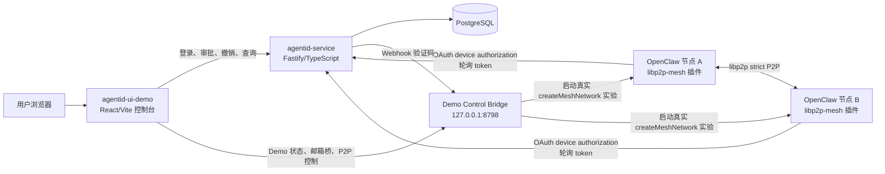
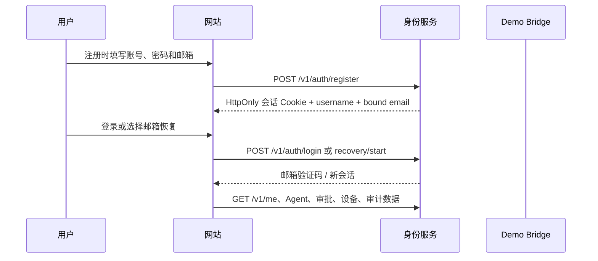

# AgentID Demo 项目结构与工作流程

## 1. 项目定位

本项目演示以下完整链路：

```text
用户注册/登录
  -> OpenClaw 客户端发起设备授权
  -> 网站展示申请的权限和设备信息
  -> 用户使用 WebAuthn Passkey 确认
  -> 身份服务签发 IBC
  -> OpenClaw 客户端保存 IBC
  -> 两个 OpenClaw 节点进行 P2P 通信并验证 AgentID
  -> 撤销其中一个绑定后，该节点的消息被拒绝
```

核心身份关系为：

```text
User ID -> AgentID -> InstanceID -> Instance public key -> PeerID
```

其中：

- `User ID`：网站账户 ID。
- `AgentID`：代表一个逻辑 Agent 的稳定 DID，例如 `did:agentid:agt_xxx`。
- `InstanceID`：某一个 OpenClaw 客户端实例的身份 ID。
- `Instance public key`：实例的 Ed25519 公钥。
- `PeerID`：libp2p 网络层节点 ID。
- `JTI`：一次具体实例绑定凭证的唯一编号。
- `IBC`：Identity Binding Credential，服务端签发、客户端保存的 Ed25519 JWS 凭证。

`AgentID` 不等于 `InstanceID`。一个 Agent 可以绑定多个 Instance，但同一个 `AgentID + InstanceID` 同时只能存在一个 active binding。

## 演示视频

当前实现的串行演示视频：

[打开 AgentID Demo 完整演示视频](</Users/lin/Downloads/AgentIDDemo/output/playwright/agentid-demo-one-by-one.mp4>)

视频按真实操作顺序展示：

```text
A 客户端终端输入命令
  -> A 输出设备授权 URL
  -> 网站登录和 Passkey 授权
  -> A 终端输出 IBC 已保存
  -> B 客户端终端输入命令
  -> B 输出设备授权 URL
  -> 网站登录和 Passkey 授权
  -> B 终端输出 IBC 已保存
  -> A/B 双向 P2P 验证
  -> 撤销 A 后验证 A 的消息被拒绝
```

## 2. 总体架构



### 2.1 模块职责

| 模块 | 主要职责 | 是否保存私钥/完整 IBC |
|---|---|---|
| `agentid-service` | 用户登录、Passkey、AgentID 创建、设备审批、绑定记录、IBC 签发、撤销和状态查询 | 服务端保存绑定记录和 IBC；不保存客户端 Instance 私钥 |
| `agentid-ui-demo` | 登录页面、授权确认页、Agent/设备状态、审计和 Demo 操作 | 不保存 Instance 私钥；浏览器认证器保存 Passkey 私钥 |
| `libp2p-mesh` | OpenClaw P2P 网络、InstanceID、PeerID、AgentID CLI、IBC 本地验证、消息签名和接收验证 | 客户端保存 Instance 私钥和本地 IBC 绑定文件 |
| `demo/runner.mjs` | 启动服务、网页、两个隔离 OpenClaw profile 和本地控制桥 | 只操作 Demo 专用 profile 和数据库 |
| `demo/p2p-runner.mjs` | 启动 A/B 两个真实 libp2p worker，执行双向和撤销后的验证实验 | 读取 Demo binding，不向网页暴露完整 IBC |
| PostgreSQL | 持久化用户、Agent、成员、设备授权、实例绑定和审计数据 | 不保存客户端实例私钥 |

### 2.2 端到端工作方式

系统分为四个层次：

1. **账户层**：网站默认通过用户名和密码识别用户，密码以加盐 `scrypt` 哈希保存；邮箱验证码仍作为旧账户兼容入口。WebAuthn Passkey 用于创建 Agent、批准设备和撤销绑定等敏感操作确认。
2. **授权层**：OpenClaw 客户端使用 OAuth Device Authorization + PKCE 请求授权；网站确认后，服务端将用户、Agent 和 Instance 绑定，并签发 IBC。
3. **实例层**：每个 OpenClaw profile 拥有独立 InstanceID、Ed25519 实例密钥和 PeerID。InstanceID 表示本地实例，PeerID 表示当前 libp2p 网络节点。
4. **通信层**：P2P 消息携带 Instance 身份和 IBC。接收端先验证消息签名，再验证 IBC、scope、时间和撤销状态，最后才交给消息处理器。

网站只负责身份和授权控制；OpenClaw 客户端负责本地私钥、IBC 保存和消息签名；P2P 节点之间不通过网站转发消息。

## 3. 目录结构

以下是运行相关的主要结构，省略 `node_modules`、构建产物和历史测试素材：

```text
/Users/lin/Downloads/AgentIDDemo/
├── package.json                         # Demo Runner 根命令
├── DEMO.md                              # Demo 启动、操作和测试说明
├── PROJECT-STRUCTURE-AND-WORKFLOWS.md   # 本文档
├── AGENT-DISCOVERY-CONNECTION-DESIGN.md  # 公共发现、网页建链和客户端自主发现方案
├── demo/
│   ├── runner.mjs                        # 一键启动器和本地控制桥
│   ├── p2p-runner.mjs                    # 双节点实验协调器
│   └── p2p-worker.mjs                    # 单个真实 libp2p 节点进程
├── agentid-service/
│   ├── src/
│   │   ├── server.ts                     # 服务启动入口
│   │   ├── app.ts                        # Fastify 路由、认证、OAuth、审批
│   │   ├── store.ts                      # 内存/ PostgreSQL 数据访问
│   │   ├── auth.ts                       # WebAuthn Passkey 适配器
│   │   ├── crypto.ts                     # Ed25519 issuer 密钥和 IBC 签发
│   │   ├── domain.ts                     # 用户、Agent、绑定、审批类型
│   │   ├── metrics.ts                    # Prometheus 指标
│   │   ├── alerts.ts                     # 结构化告警日志
│   │   └── audit.ts                      # 审计事件和哈希链
│   ├── migrations/                       # PostgreSQL 表结构迁移
│   ├── scripts/backup.mjs                # pg_dump 备份命令
│   └── ops/agentid-alerts.yml            # Prometheus 告警规则
├── agentid-ui-demo/
│   ├── control-plane.html                # 主控制台入口
│   ├── device.html                       # OAuth 设备授权深链接入口
│   ├── src/
│   │   ├── control-plane.tsx             # 登录、Agent、审批、设备、Demo 面板
│   │   ├── agent-public.tsx              # 公开 Agent 目录、搜索、筛选和详情页
│   │   ├── agent-public.css              # 公开目录和详情页样式
│   │   ├── agentid-api.ts                # 身份服务和 Demo Bridge API 客户端
│   │   └── control-plane.css             # 控制台样式
│   ├── tests/demo-e2e.spec.ts            # Chromium Virtual Authenticator E2E
│   └── playwright.demo.config.ts         # Demo 专用 Playwright 配置
└── openclawAgentid/
    ├── libp2p-mesh/

    │   ├── src/instance-id.ts            # InstanceID 和 Ed25519 实例密钥
    │   ├── src/agentid.ts                # IBC、JWKS、OAuth link/status/refresh
    │   ├── src/agentid-cli.ts            # OpenClaw agentid 命令组
    │   ├── src/agentid-maintenance.ts    # 定时状态刷新和自动续期
    │   ├── src/message-auth.ts            # P2P 消息签名和 AgentID 验证
    │   ├── src/mesh.ts                   # libp2p 网络、发送、接收、PeerID
    │   ├── src/instance-router.ts        # Instance 路由和状态存储
    │   ├── src/plugin.ts                 # OpenClaw 插件注册入口
    │   └── test/                         # AgentID、P2P、双节点集成测试
    ├── agentid-website-design.md         # 网站设计方案
    ├── agentid-openclaw-instance-authorization-design.md
    └── plugin-system-design.md           # 插件系统设计文档
```

公开属性管理补充流程：

```text
Owner/Admin 登录控制台
  -> 选择 Agent / 公开资料
  -> 编辑简介、角色、运行环境、能力、标签和项目
  -> 为每一项选择公开或不公开
  -> 查看访客预览
  -> PATCH /v1/agents/{agentId}/public-profile
  -> 服务端保存、写入审计事件并返回权威资料
  -> /agent-public.html 每 10 秒拉取公开目录
```

公开目录使用身份服务的匿名只读 API：

```text
GET /v1/public/agents?query=&tag=&verified=
GET /v1/public/agents/{agentId}
```

公开 API 只返回已发布 Agent 的公开属性；隐藏属性、用户 ID、邮箱、成员关系、InstanceID、JTI、公钥和完整 IBC 均不会返回。能力属性保留 `self_declared` / `verified` 信任标签，AgentID 身份验证不代表能力已经被验证。

公开发现到 P2P 通信的边界：

```text
第三方 / 第三方 Agent
  -> 在公开目录搜索名称、能力、标签或 AgentID
  -> 打开 Agent 详情页，查看公开属性和身份状态
  -> 生成 { agentId, message } 调用参数
  -> 在己方 OpenClaw 中调用 p2p_send_agent_message
  -> 客户端只选择本地 Mesh 已发现且 IBC 验证通过的目标实例
  -> 使用现有签名消息和 ACK 完成 P2P 通信
```

网页不持有实例私钥，也不直接拨号或转发 P2P 消息。`p2p_send_agent_message` 会按已验证的 `AgentID` 找到一个或多个实例并逐一发送；没有已发现路由时返回明确错误。当前 Demo 不实现网站侧连接申请、对方审批和异步排队，第三方必须先让目标实例加入同一 Mesh 并完成 announce/IBC 验证。

## 4. 启动与进程管理流程

### 4.1 启动命令

在项目根目录执行：

```bash
npm run demo:start
```

Runner 执行顺序如下：

1. 检查 `.demo/runner.json`，阻止重复启动。
2. 启动仅监听 `127.0.0.1:8798` 的 Demo Control Bridge。
3. 检查 PostgreSQL；数据库不存在时创建 `agentid_demo`。
4. 执行身份服务数据库迁移。
5. 启动身份服务：`http://localhost:8787`。
6. 启动控制台：`http://localhost:4173/control-plane.html`。
7. 构建 `libp2p-mesh` 插件。
8. 创建两个隔离的 OpenClaw profile：
   - `agentid-demo-a`
   - `agentid-demo-b`
9. 为两个 profile 安装本地插件并设置 `strict` AgentID 验证模式。
10. 启动两个 OpenClaw gateway。
11. 分别执行 `libp2p-mesh agentid link`，生成两个 OAuth 授权请求。
12. 将进程日志、授权 URL、IBC 保存和网关重启事件写入 Demo Bridge 内存事件流。

Demo 使用的网页 Origin 和 WebAuthn RP ID 是 `localhost`。服务和网关监听在本机回环地址，控制桥单独监听 `127.0.0.1`。

### 4.2 其他命令

```bash
npm run demo:status   # 查看服务、两个客户端和 P2P 状态
npm run demo:stop     # 按 Runner PID 停止所有子进程
npm run demo:reset    # 清空 Demo 数据库、profile 和临时状态
```

非 Demo 的 OpenClaw profile 和生产数据库不会被这些命令操作。

## 5. 用户登录流程



新账号注册时，身份服务创建唯一 username、密码哈希和唯一绑定邮箱；登录时可提交 username 或绑定邮箱。忘记密码时，身份服务向绑定邮箱发送一次性恢复验证码，验证后更新密码并创建新会话。没有邮箱的旧账号可在“账户与安全”页面绑定邮箱；旧邮箱验证码登录仍保留兼容入口。

生产环境应替换本地邮箱桥为邮件服务商，并保持验证码一次性、限时和限流策略。

## 6. OpenClaw 授权流程

### 6.1 客户端发起授权

客户端执行：

```bash
openclaw libp2p-mesh agentid link --issuer http://localhost:8787
```

客户端完成以下工作：

1. 读取或生成当前 profile 的 InstanceID 和 Ed25519 实例密钥。
2. 生成 PKCE verifier 和 S256 challenge。
3. 向身份服务发送 `POST /oauth/device_authorization`。
4. 请求中携带 InstanceID、公钥、设备标签、平台、scope 和 PKCE challenge。
5. 服务端返回 `request_id`、`device_code`、设备深链接和轮询间隔。
6. 客户端打开：

   ```text
   http://localhost:4173/device?request_id=<request_id>
   ```

二维码或深链接只包含 `request_id`，不包含私钥、Cookie 或长期凭证。

### 6.2 网站展示授权请求

网站通过 `request_id` 调用：

```text
GET /v1/approvals/{request_id}
```

授权页面展示：

- 设备名称和平台
- 实例公钥指纹
- 申请的 scope，例如 `p2p:announce`、`p2p:message`
- 目标 Agent 或待创建的 AgentID
- 设备授权到期时间

用户必须登录，只有 Agent Owner/Admin 可以批准设备。

### 6.3 Passkey 确认

首次高风险操作：

```text
POST /v1/auth/webauthn/registration/options
浏览器 navigator.credentials.create()
POST /v1/auth/webauthn/registration/verify
```

后续高风险操作：

```text
POST /v1/auth/webauthn/authentication/options
浏览器 navigator.credentials.get()
POST /v1/auth/webauthn/authentication/verify
```

Passkey 私钥只保存在浏览器或系统认证器中，网站服务端只保存公钥、计数器和凭证元数据。

开发备用口令不是默认流程，只有显式设置 `VITE_ALLOW_DEMO_PASSKEY=1` 时才显示。

### 6.4 批准和签发 IBC

Passkey step-up 成功后，网站调用：

```text
POST /v1/approvals/{request_id}/approve
```

服务端在事务内完成：

1. 校验当前用户对 Agent 的 Owner/Admin 权限。
2. 创建 Agent 或使用用户选择的已有 Agent。
3. 创建唯一 `JTI`。
4. 创建 `instance_bindings` 记录。
5. 签发 Ed25519 JWS IBC。
6. 将审批状态更新为 `approved`。
7. 写入审计事件。

IBC 重要声明包括：

```json
{
  "iss": "http://localhost:8787",
  "sub": "did:agentid:agt_xxx",
  "aud": "openclaw-libp2p-mesh",
  "jti": "binding-uuid",
  "instance_id": "instance-id",
  "instance_public_key": "ed25519-public-key",
  "scope": ["p2p:announce", "p2p:message"],
  "iat": 1780000000,
  "exp": 1790000000
}
```

网站不会把完整 IBC 返回到 Demo 状态面板。

Agent 公开资料不是 IBC 的一部分。它是由 Agent Owner/Admin 维护的可选展示数据，身份服务只负责保存发布状态和属性可见性；P2P 身份验证仍然只依赖 IBC、实例公钥、scope、有效期和撤销状态。

### 6.5 客户端轮询和保存

客户端轮询：

```text
POST /oauth/token
```

轮询使用 `device_code`、PKCE verifier 和 client ID。批准后，服务端返回一次性 IBC。客户端：

1. 验证 issuer 是否在 trusted issuer 配置中。
2. 从 JWKS 按 `kid` 获取签名公钥。
3. 校验 EdDSA 签名、issuer、audience、subject、JTI、时间和 scope。
4. 校验 IBC 中的 InstanceID、公钥是否匹配本地实例。
5. 原子写入：

   ```text
   $OPENCLAW_STATE_DIR/libp2p/agentid-binding.json
   ```

6. 文件权限为 `0600`，父目录为 `0700`。
7. 客户端保存 AgentID、`userIdHash`、JTI、IBC、scope、状态和到期时间；不保存原始 User ID。

服务端只允许 IBC 被兑换一次。

## 7. P2P 身份验证流程

### 7.1 节点启动

`libp2p-mesh` 插件启动时：

1. 加载或创建 InstanceID 和实例密钥。
2. 加载本地 binding 文件。
3. 启动 AgentID maintenance。
4. 主动刷新一次 binding 状态。
5. 启动 libp2p，生成或加载 PeerID。
6. 注册 instance announce 和消息协议。

Demo 双节点实验使用独立的 `demo-peer-id.json`，并关闭 mDNS、DHT 和 NAT traversal，只使用本机 TCP 地址建立真实 libp2p 连接。

### 7.2 出站消息

带 AgentID 的消息签名载荷包含：

```text
原有消息字段
instanceId
pubkey
agentId
instanceBinding
timestamp
signature
```

`agentId` 和 `instanceBinding` 会进入签名载荷，因此不能在传输过程中被替换。

### 7.3 入站验证

接收端顺序验证：

1. 验证外层 libp2p peer/stream。
2. 使用消息携带的实例公钥验证 Instance 签名。
3. 使用 trusted issuer JWKS 验证 IBC Ed25519 签名。
4. 验证 IBC 的 `instance_id`、`instance_public_key`、`sub` 和消息字段一致。
5. 验证 scope、`iat`、`exp` 和 issuer。
6. 查询或读取 `(issuer, jti)` binding 状态缓存。
7. 只有全部通过后才交给消息处理器。

### 7.4 compat 和 strict

| 模式 | 无 AgentID/IBC 的旧消息 | 携带无效 IBC 的消息 | 缺少 IBC 的新消息 |
|---|---|---|---|
| `compat` | 接受 | 拒绝 | 允许作为旧消息 |
| `strict` | 拒绝 | 拒绝 | 拒绝 |

Demo 的两个 P2P 节点使用 `strict`。生产默认策略可以继续使用 `compat`，再逐步切换到 `strict`。

## 8. 撤销、刷新和续期

### 8.1 撤销

网站撤销设备时调用：

```text
POST /v1/agents/{agentId}/instances/{instanceId}/revoke
```

服务端将 binding 状态改为 `revoked`，记录撤销用户和审计事件。控制桥查询：

```text
GET /v1/instance-bindings/{jti}/status
```

因此网站可以立即显示权威的 `revoked`，不必等待客户端本地文件刷新。

### 8.2 运行期间刷新

客户端维护任务默认每 15 分钟刷新一次，配置范围为 60 到 86400 秒。刷新时：

- `active` 且接近到期时执行 challenge/renew。
- 续期成功后原子替换本地 IBC、JTI 和到期时间。
- 发现 `revoked` 或 `expired` 时从内存中移除可发送 binding。
- 身份服务暂时不可达时，仍使用未过期的本地 binding。
- 本地 IBC 到期后停止携带 AgentID 发送。

客户端命令：

```bash
openclaw libp2p-mesh agentid status
openclaw libp2p-mesh agentid refresh
openclaw libp2p-mesh agentid unlink
```

### 8.3 Demo 撤销后的 P2P 实验

Demo 会重新启动两个独立的真实 libp2p worker：

1. A 使用已撤销 binding 发送消息。
2. B 使用 strict 模式拒绝 A 的消息。
3. B 使用 active binding 发送消息。
4. A 仍能验证 B 的消息。
5. 控制台显示一条通过事件和一条被拒绝结果。

## 9. Demo Control Bridge

Bridge 只监听 `127.0.0.1:8798`，不是生产 API。

| 接口 | 用途 |
|---|---|
| `GET /demo/status` | 服务健康、A/B 客户端、绑定摘要、P2P 状态 |
| `GET /demo/events` | 登录、授权、IBC 保存、网关重启和 P2P 事件 |
| `GET /demo/mailbox?email=...` | 读取本地演示验证码 |
| `POST /demo/p2p/start` | 启动 initial 或 after-revoke 双节点实验 |
| `POST /demo/reset` | 清空 Demo 数据并退出当前 Runner |

Bridge 返回的客户端摘要包括：

- InstanceID
- AgentID
- 绑定用户 ID 哈希（`userIdHash`）
- JTI
- scope
- active/revoked/expired 状态
- 到期时间
- 公钥指纹

Bridge 不返回完整 IBC、实例私钥、设备码或网站 Cookie。

## 10. 关键数据关系

```text
users
  └── agent_members
        └── agents
              └── instance_bindings
                    ├── jti
                    ├── instance_id
                    ├── instance_public_key
                    ├── approved_by_user_id
                    ├── status
                    └── ibc

users
  ├── sessions
  ├── magic_link_tokens
  ├── webauthn_credentials
  └── audit_events

device_authorizations
  └── binding_jti -> instance_bindings.jti
```

### 10.1 身份对象

#### User ID

网站用户的稳定标识，服务端内部使用，例如：

```json
{
  "id": "usr_976fb52188e44cb2b64c720753c6db3d",
  "email": "user@example.com",
  "displayName": "user",
  "createdAt": "2026-07-13T04:36:42.000Z"
}
```

`User ID` 只用于网站账户、成员关系、审批人和审计记录。它不会作为 P2P 消息中的可信身份来源；P2P 侧可信的 AgentID 必须从已验证 IBC 的 `sub` 得到。

#### AgentID

AgentID 是逻辑 Agent 的稳定标识。一个用户可以创建多个 Agent，一个 Agent 也可以绑定多个 OpenClaw Instance。

```json
{
  "id": "did:agentid:agt_5af57039adcb46fcae750cc4",
  "name": "Research Assistant",
  "createdBy": "usr_976fb52188e44cb2b64c720753c6db3d",
  "memberRole": "owner",
  "status": "active"
}
```

Agent 成员角色为：

| 角色 | 权限 |
|---|---|
| `owner` | 修改 Agent、管理成员、批准和撤销设备 |
| `admin` | 管理成员和设备，但不能执行 Owner 级操作 |
| `viewer` | 查看 Agent、实例和审计信息 |

#### InstanceID

InstanceID 表示一个具体的 OpenClaw 客户端实例。它绑定到实例的 Ed25519 公钥，而不是绑定到机器名称本身。实例公钥变化时，应视为新的实例身份。

```json
{
  "instanceId": "lin-lindeMac-mini@GfB3Zu6dgKcO.41145fb2",
  "instanceName": "lin-lindeMac-mini",
  "instancePublicKey": "MCowBQYDK2VwAyEA...",
  "instancePublicKeyFingerprint": "zZAQrf4rY9jbiFdT"
}
```

#### PeerID

PeerID 是 libp2p 网络层节点标识，用于建立连接和识别网络对端。它和 InstanceID 的关系是：

```text
一个 OpenClaw 运行实例
  -> 一个 InstanceID 和实例密钥
  -> 一个当前运行中的 libp2p PeerID
```

PeerID 可能因网络节点密钥或 Demo worker 重启而变化，因此不能替代 AgentID 或 InstanceID。

### 10.2 IBC 数据结构

IBC（Identity Binding Credential）是身份服务签发给 OpenClaw 实例的实例绑定凭证。当前实现使用 Ed25519 签名的 JWS，包含标准 JWS Header 和 Claims 两部分。

#### JWS Header

```json
{
  "alg": "EdDSA",
  "typ": "JWT",
  "kid": "issuer-key-2026-01"
}
```

- `alg`：固定为 `EdDSA`。
- `kid`：签发者公钥版本，用于接收端从 JWKS 选择验证公钥。
- `typ`：表示这是一个 JWT/JWS 格式的签名凭证。

#### IBC Claims

```json
{
  "iss": "http://localhost:8787",
  "sub": "did:agentid:agt_5af57039adcb46fcae750cc4",
  "aud": "openclaw-libp2p-mesh",
  "jti": "e4fb6d76-c357-4992-aa10-8dd627097f72",
  "user_id_hash": "q7QmY7y3fP2dB9uK8m1cV4xN6sR0tL5wA3eH9jD2kFg",
  "instance_id": "lin-lindeMac-mini@GfB3Zu6dgKcO.41145fb2",
  "instance_public_key": "MCowBQYDK2VwAyEA...",
  "scope": ["p2p:announce", "p2p:message"],
  "iat": 1783917418,
  "exp": 1791609418
}
```

这里不放原始 `user_id`，而是放 `user_id_hash`。它由身份服务使用稳定的 `USER_ID_HASH_SECRET` 对内部用户 ID 做 HMAC-SHA256，形成不可逆的发行者范围伪名。服务端仍然保存 `user_id -> AgentID` 的成员关系，但完整 User ID 不会进入 IBC Claims、OAuth 响应或 P2P 消息，避免向通信对端泄露网站账户信息。

因此当前信任链是：

```text
User ID
  -> 网站服务端确认用户有权管理 AgentID
  -> 服务端为 InstanceID 签发 IBC
  -> P2P 对端验证 AgentID、InstanceID、公钥和 scope
```

接收端只验证 `user_id_hash` 的格式和签名，不尝试从哈希恢复用户身份。新签发的 IBC 必须包含该字段；为了兼容历史凭证，`compat` 模式仍可接受没有该字段的旧 IBC。只有持有同一发行者密钥并且已经知道候选内部 User ID 的受控服务，才可以计算并比较该伪名；普通第三方无法据此得到邮箱或原始用户 ID。

字段含义：

| 字段 | 含义 | 接收端校验 |
|---|---|---|
| `iss` | IBC 签发者 | 必须匹配配置中的可信 issuer |
| `sub` | 可信 AgentID | 作为消息中的最终 AgentID 来源 |
| `aud` | 目标客户端/插件 | 必须匹配 `openclaw-libp2p-mesh` |
| `jti` | 当前绑定凭证唯一 ID | 用于一次兑换、撤销查询和缓存键 |
| `user_id_hash` | 发行者密钥保护的用户 ID 伪名 | 必须随 IBC 签名校验；不得反解或当作原始 User ID 展示 |
| `instance_id` | 被授权的 InstanceID | 必须匹配消息声明和本地/远端实例身份 |
| `instance_public_key` | 被授权的实例公钥 | 必须匹配消息签名公钥 |
| `scope` | 允许的操作范围 | 发送 announce/message 前必须包含对应权限 |
| `iat` / `exp` | 签发时间和过期时间 | 校验时间窗口和凭证是否过期 |

IBC 不是用户登录 Cookie，也不是网站会话令牌。它是可以在 P2P 消息中传播、由接收端离线验证的授权证明。完整 IBC 只保存在服务端绑定记录和客户端本地绑定文件中，网站列表和 Demo Bridge 只展示 `JTI`、状态、AgentID、`user_id_hash`、scope 和到期时间；客户端管理命令如需展示用户关联，也只展示 `user_id_hash`。

### 10.3 本地绑定文件

OpenClaw 客户端将 IBC 保存到：

```text
$OPENCLAW_STATE_DIR/libp2p/agentid-binding.json
```

逻辑结构如下：

```json
{
  "agentId": "did:agentid:agt_5af57039adcb46fcae750cc4",
  "userIdHash": "issuer-keyed-hmac-sha256-user-pseudonym",
  "issuer": "http://localhost:8787",
  "jti": "e4fb6d76-c357-4992-aa10-8dd627097f72",
  "instanceId": "lin-lindeMac-mini@GfB3Zu6dgKcO.41145fb2",
  "instancePublicKey": "MCowBQYDK2VwAyEA...",
  "instanceBinding": "<完整 EdDSA JWS IBC>",
  "status": "active",
  "scopes": ["p2p:announce", "p2p:message"],
  "expiresAt": 1791609418,
  "lastStatusCheckAt": 1783917429
}
```

安全要求：

- 私钥和绑定文件不进入网页、P2P 路由记录或审计详情。
- 绑定文件使用临时文件、`fsync` 和 rename 原子替换。
- 绑定目录权限为 `0700`，绑定文件权限为 `0600`。
- 客户端启动、定时刷新或 `agentid refresh` 时检查绑定状态。
- `revoked`、`expired` 或公钥/InstanceID 不匹配时，客户端停止携带 AgentID 发送消息。

### 10.4 P2P 消息身份载荷

带 AgentID 的消息会把身份字段放入签名载荷：

```json
{
  "instanceId": "lin-lindeMac-mini@GfB3Zu6dgKcO.41145fb2",
  "pubkey": "MCowBQYDK2VwAyEA...",
  "agentId": "did:agentid:agt_5af57039adcb46fcae750cc4",
  "instanceBinding": "<IBC>",
  "message": "verified AgentID",
  "timestamp": 1783917429,
  "signature": "<instance Ed25519 signature>"
}
```

接收端不能只相信外层 `agentId` 字段。正确的可信链为：

```text
实例私钥签名
  -> 证明消息来自对应 Instance 公钥
  -> IBC issuer 签名
  -> 证明该公钥被授权给该 AgentID
  -> binding 状态和 scope 校验
  -> 接受消息
```

重要约束：

- username 唯一且不区分大小写；新账户必须绑定唯一邮箱。
- Agent 成员角色包含 Owner、Admin、Viewer。
- 同一 Agent 和 Instance 的 active binding 唯一。
- JTI 唯一且 IBC 兑换一次。
- 审批、撤销、成员变更使用幂等键。
- 审计事件只追加，不记录私钥、完整 IBC 或设备码。

## 11. 测试结构和验收命令

### 服务端

```bash
cd agentid-service
npm run check
npm test
npm run build
```

覆盖登录、Passkey step-up、OAuth device grant、IBC、撤销、健康检查、指标和限流。

### libp2p 插件

```bash
cd openclawAgentid/libp2p-mesh
npm run build
npm test
```

覆盖：

- IBC/JWKS 验签
- AgentID/InstanceID/公钥篡改检测
- strict/compat
- 撤销缓存和定时刷新
- IBC 自动续期
- 两个真实 libp2p 节点双向通信
- 文件权限和重启恢复

### 浏览器 Demo E2E

先启动 Demo，再执行：

```bash
cd agentid-ui-demo
npm run test:demo
```

测试使用本机 Chrome Virtual Authenticator，覆盖：

1. 账号、密码和邮箱注册。
2. 用户名或绑定邮箱密码登录。
3. 邮箱验证码恢复密码；验证码按 login、recovery、binding 用途隔离。
4. 旧邮箱验证码登录兼容路径。
3. 首次真实 Passkey 登记。
4. A/B 两次设备授权。
4. 两个不同 InstanceID 绑定到同一个 AgentID。
5. IBC 保存和双向 P2P 验证。
6. 撤销 A 后的单向验证结果。

录屏需要安装 `ffmpeg`：

```bash
DEMO_RECORD=1 npm run test:demo
```

## 12. 当前边界

当前项目是本地 Demo，不是生产部署：

- 邮箱验证码通过本地 Webhook Bridge 展示，没有接入真实邮件供应商；生产环境需接入邮件服务商。
- WebAuthn 使用真实浏览器认证器；开发备用口令必须显式开启。
- Demo 使用本地 PostgreSQL 和本地 issuer 密钥，不接入 KMS/HSM。
- Control Bridge 只允许本机访问。
- P2P Demo 不实现消息渠道入站投递。
- 生产环境仍需 HTTPS、正式登录会话、邮件服务、密钥托管、备份恢复、限流和监控平台。
